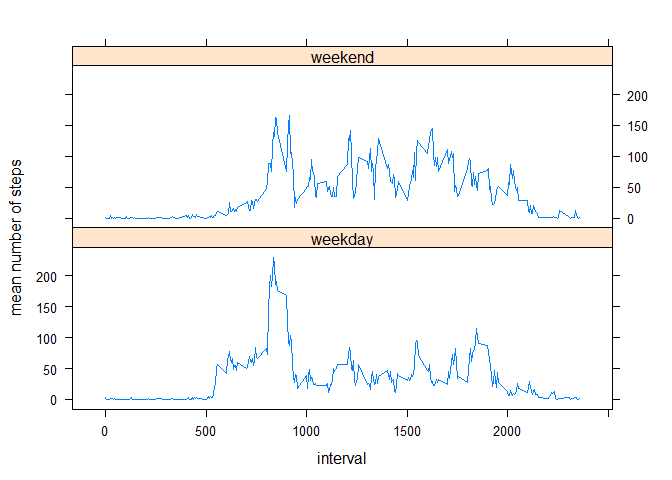

# Reproducible Research: Peer Assessment 1


## Loading and preprocessing the data

```r
library(plyr)
library(dplyr)
```

```
## Warning: package 'dplyr' was built under R version 3.3.3
```

```
## 
## Attaching package: 'dplyr'
```

```
## The following objects are masked from 'package:plyr':
## 
##     arrange, count, desc, failwith, id, mutate, rename, summarise,
##     summarize
```

```
## The following objects are masked from 'package:stats':
## 
##     filter, lag
```

```
## The following objects are masked from 'package:base':
## 
##     intersect, setdiff, setequal, union
```

```r
library(lattice)
unzip("activity.zip")
activity<-read.csv("activity.csv")
```


## What is mean total number of steps taken per day?

We first group by date before computing the daily sums.


```r
daily<-activity %>% group_by(date) %>% summarise(dailysums=sum(steps, na.rm=TRUE))
hist(daily$dailysums, breaks=20, xlab="number of steps", main="Daily steps")
```

<!-- -->

```r
x<-mean(daily$dailysums)
y<-median(daily$dailysums)
```
The mean number of steps taken in a day in the sample is 9354.2295082, the median is 10395.


## What is the average daily activity pattern?

After getting rid of the missing value, we group this time by interval and compute once again the means for the intervals.


```r
activityCC<-activity[complete.cases(activity),]
means<-activityCC %>% group_by(interval) %>% summarise(means=mean(steps))
with(means,plot(interval,means, type="l", ylab="mean number of steps"))
```

<!-- -->

```r
means[which.max(means$means),]
```

```
## # A tibble: 1 x 2
##   interval    means
##      <int>    <dbl>
## 1      835 206.1698
```

The most steps, 206, are on average taken between 8:35am and 8:40am. 

## Imputing missing values
We impute the missing values with the mean values for the respective 5-minute intervals. We then plot a new histogram and calculate the new mean and median.

```r
sum(!complete.cases(activity))
```

```
## [1] 2304
```

```r
activityImp<-activity
for (i in 1:(nrow(activity))) {
    if (is.na(activity[i,1])) {
        activityImp[i,1]<-means$means[activity[i,3]==means$interval]
    }
}
dailyImp<-activityImp %>% group_by(date) %>% summarise(ds=sum(steps, na.rm=TRUE))
hist(dailyImp$ds, breaks=20, main="Daily steps", xlab="number of steps")
```

<!-- -->

```r
mean(dailyImp$ds)
```

```
## [1] 10766.19
```

```r
median(dailyImp$ds)
```

```
## [1] 10766.19
```

We have 2304 missing values. The new mean and median number of steps per day are 10766. It might seem a bit surprising that median and mean are exactly equal, but it's easily explained by the fact that we filled a couple of days with no data with all the mean values and one of those days happens to be at the center of the distribution now.

## Are there differences in activity patterns between weekdays and weekends?

We add a weekend-weekday factor w to the dataset and group the data by this factor before plotting it on a timeline.


```r
for (i in 1:(nrow(activityImp))) {
    if (weekdays(as.Date(activity[i,2], "%Y-%m-%d")) %in% c("Saturday", "Sunday")) {
        activityImp$w[i]<-"weekend"
    }
    else {
        activityImp$w[i]<-"weekday"
    }
}
meansImp<-activityImp %>% group_by(interval, w) %>% summarise(mean=mean(steps))
xyplot(mean~interval|w, data=meansImp, layout=c(1,2), type="l", ylab="mean number of steps")
```

<!-- -->

The patterns look similar although there's a pointier spike around 8am on weekdays when people are heading to work. On the weekend the distribution of steps over the waking hours is a bit flater since people aren't stuck at work.
